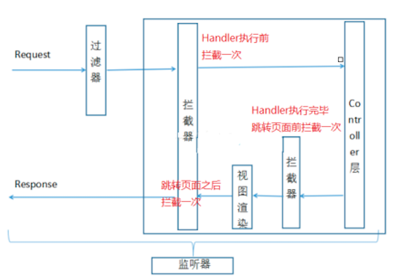

# SpringMVC课程学习

## MVC的体系结构模式

三层架构包括:**表现层、业务层、持久层**

**表现层**:

- 表现层通常是我们所说的web层,负责接收客户端的请求,向客户端响应结果,客户端使用http协议请求web层,web层需要接收http请求完成http的响应
- 表现层依赖于业务层,接收到客户端请求一般会调用业务层进行业务处理,并将处理结果响应给客户端

**业务层**:

- 也就是我们常说的service层,它负责业务逻辑处理,web层依赖于service层,servcie层不依赖web层

**持久层**:

通常就是dao层,负责数据持久化,包括数据层即数据库和数据访问层,数据库是对数据进行持久化的载体,数据访问层是业务层与次就曾交互的接口,业务层通过数据访问层将数据持久化到数据库中,通常来说,持久层就是用于对数据库进行增删改查的

### MVC设计模式

MVC全名为Model View Controller,是模型(model)-视图(View)-控制器(Controller)的简写,一种设计与web应用程序表现层的模式

- Model层:模型包括业务模型与数据模型,数据模型用于封装数据,业务模型用户处理数据

- View层:就是前端工程,用于展示数据,依赖于模型数据
- Controller层:应用程序处理与用户交互的部分,用于处理程序逻辑

MVC是每一层只编写自己的东西,不编写其他不相关的代码,分层用于解耦,解耦便于扩展与维护

## 什么是Spring MVC

Spring MVC通常可以认为是对servlet的封装,简化了我们对servlet的开发

作用:接收请求->返回响应,跳转页面


### Spring MVC的请求处理流程


流程说明:

1. 第⼀步：用户发送请求⾄前端控制器DispatcherServlet
2. 第⼆步：DispatcherServlet收到请求调用HandlerMapping处理器映射器
3. 第三步：处理器映射器根据请求Url找到具体的Handler（后端控制器），⽣成处理器对象及处理器拦截器(如果有则⽣成)⼀并返回DispatcherServlet
4. 第四步：DispatcherServlet调用HandlerAdapter处理器适配器去调用Handler
5. 第五步：处理器适配器执行Handler
6. 第六步：Handler执行完成给处理器适配器返回ModelAndView
7. 第七步：处理器适配器向前端控制器返回 ModelAndView，ModelAndView 是SpringMVC 框架的⼀个底层对 象,包括 Model 和 View
8. 第八步：前端控制器请求视图解析器去进行视图解析，根据逻辑视图名来解析真正的视图。
9. 第九步：视图解析器向前端控制器返回View
10. 第⼗步：前端控制器进行视图渲染，就是将模型数据（在 ModelAndView 对象中）填充到 request 域
11. 第⼗⼀步：前端控制器向用户响应结果

## 创建Controller的三种方式
### 实现HttpRequestHandler接口创建Controller

```java
@FunctionalInterface
public interface HttpRequestHandler {

	/**
	 * Process the given request, generating a response.
	 * @param request current HTTP request
	 * @param response current HTTP response
	 * @throws ServletException in case of general errors
	 * @throws IOException in case of I/O errors
	 */
	void handleRequest(HttpServletRequest request, HttpServletResponse response)
			throws ServletException, IOException;

}
```

`HttpRequestHandler`用于处理`Http requests`，**其类似于一个简单的Servlet**，只有一个`handlerRequest`方法，其处理逻辑随子类的实现不同而不同。

**Demo**:

```java
 public class ControllerDemo2 implements HttpRequestHandler {
        @Override
        public void handleRequest(HttpServletRequest req, HttpServletResponse resp) throws ServletException, IOException {
            System.out.println("===实现HttpRequestHandler接口===");
        }
    }

```

```xml
<bean id="/demo2" class="com.zhengqing.controller.ControllerDemo2" ></bean>
```


### 实现Controller接口

```java
@FunctionalInterface
public interface Controller {

   /**
    * Process the request and return a ModelAndView object which the DispatcherServlet
    * will render. A {@code null} return value is not an error: it indicates that
    * this object completed request processing itself and that there is therefore no
    * ModelAndView to render.
    * @param request current HTTP request
    * @param response current HTTP response
    * @return a ModelAndView to render, or {@code null} if handled directly
    * @throws Exception in case of errors
    */
   @Nullable
   ModelAndView handleRequest(HttpServletRequest request, HttpServletResponse response) throws Exception;

}
```

实现Controller接口是SpringMVC早期的实现方式,同样也只有一个HandleRequest方法,需要在配置文件中配置实现类的具体路径与URL进行注入

**Demo**:

```java
 public class ControllerDemo1 implements Controller {
        @Override
        public ModelAndView handleRequest(HttpServletRequest req, HttpServletResponse resp) throws Exception {
            System.out.println("===方式一：实现Controller接口===");
            //使用ModelAndView去响应
            ModelAndView mav = new ModelAndView();//模型数据和视图对象
            mav.addObject("msg","helloworld");//添加模型数据
            mav.setViewName("/hello.jsp");//设置视图路径      是一个转发
            return mav;
        }
    }

```

**XML配置**:

```xml
<bean id="/demo1" class="com.zhengqing.controller.ControllerDemo1" ></bean>
```

### 使用注解的方式

```java
@Controller   //创建对象
    //@RequestMapping("/demo")
    public class ControllerDemo3 {
        @RequestMapping("/demo3")  //配置访问路径  注意：如果类上面添加了@RequestMapping("/demo")  则此时访问将变成/demo/demo3
        @ResponseBody
        public void test(){
            System.out.println("方式三：普通类+注解");
        }
    }
```

## 请求参数绑定

请求参数绑定：说⽩了SpringMVC如何接收请求参数

原⽣servlet接收⼀个整型参数：

```java
String ageStr = request.getParameter("age");
Integer age = Integer.parseInt(ageStr);
```

SpringMVC框架对Servlet的封装，简化了servlet的很多操作

SpringMVC在接收整型参数的时候，直接在Handler方法中声明形参即可

```java
@RequestMapping("xxx")
public String handle(Integer age) {
	System.out.println(age);
}
```

参数绑定：取出参数值绑定到handler方法的形参上

- 默认⽀持 Servlet API 作为方法参数

  ```java
  /**
  *
  * SpringMVC 对原⽣servlet api的⽀持 url：/demo/handle02?id=1
  *
  * 如果要在SpringMVC中使用servlet原⽣对象，⽐如
  HttpServletRequest\HttpServletResponse\HttpSession，直接在Handler方法形参中声
  明使用即可
  *
  */
  @RequestMapping("/handle02")
  public ModelAndView handle02(HttpServletRequest request,
      HttpServletResponse response,HttpSession session) {
      String id = request.getParameter("id");
      Date date = new Date();
      ModelAndView modelAndView = new ModelAndView();
      modelAndView.addObject("date",date);
      modelAndView.setViewName("success");
      return modelAndView;
  }
  ```

- 绑定简单类型参数

  简单数据类型：八种基本数据类型及其包装类型

  参数类型推荐使用包装数据类型，因为基础数据类型不可以为null

  整型：Integer、int

  字符串：String

  单精度：Float、float

  双精度：Double、double

  布尔型：Boolean、boolean
  说明：对于布尔类型的参数，请求的参数值为true或false。或者1或0
  注意：绑定简单数据类型参数，只需要直接声明形参即可（形参参数名和传递的参数名要保持⼀
  致，建议使用包装类型，当形参参数名和传递参数名不⼀致时可以使用@RequestParam注解进行
  ⼿动映射）

  ```java
  /*
  * SpringMVC 接收简单数据类型参数 url：/demo/handle03?id=1
  *
  * 注意：接收简单数据类型参数，直接在handler方法的形参中声明即可，框架会取出参数值
  然后绑定到对应参数上
  * 要求：传递的参数名和声明的形参名称保持⼀致
  */
  @RequestMapping("/handle03")
  public ModelAndView handle03(@RequestParam("ids") Integer id,Boolean
  flag) {
      Date date = new Date();
      ModelAndView modelAndView = new ModelAndView();
      modelAndView.addObject("date",date);
      modelAndView.setViewName("success");
      return modelAndView;
  }
  ```

- 绑定VO类型参数

  ```java
  /*
  * SpringMVC接收pojo类型参数 url：/demo/handle04?id=1&username=zhangsan
  *
  * 接收VO类型参数，直接形参声明即可，类型就是VO的类型，形参名⽆所谓
  * 但是要求传递的参数名必须和VO的属性名保持⼀致
  */
  @RequestMapping("/handle04")
  public ModelAndView handle04(User user) {
      Date date = new Date();
      ModelAndView modelAndView = new ModelAndView();
      modelAndView.addObject("date",date);
      modelAndView.setViewName("success");
      return modelAndView;
  }
  ```

  

## Ajax Json交互

交互：两个方向
1）前端到后台：前端ajax发送json格式字符串，后台直接接收为pojo参数，使用注解@RequstBody
2）后台到前端：后台直接返回pojo对象，前端直接接收为json对象或者字符串，使用注解@ResponseBody

**什么是 Json？**

Json是⼀种与语⾔⽆关的数据交互格式，就是⼀种字符串，只是用特殊符号{}内表示对象、[]内表示数组、""内是属性或值、：表示后者是前者的值{"name": "Michael"}可以理解为是⼀个包含name为Michael的对象[{"name": "Michael"},{"name": "Jerry"}]就表示包含两个对象的数组

### @ResponseBody注解

@ResponseBody注解的作用是将controller的方法返回的对象通过适当的转换器转换为指定的格式之后，写⼊到response对象的body区，通常用来返回JSON数据或者是XML数据。 注意：在使用此注解之后不会再走视图处理器，⽽是直接将数据写⼊到输⼊流中，他的效果等同于通过response对象输出指定格式的数据。

### 分析Spring MVC 使用 Json 交互

```xml
<!--json数据交互所需jar，start-->
<dependency>
    <groupId>com.fasterxml.jackson.core</groupId>
    <artifactId>jackson-core</artifactId>
    <version>2.9.0</version>
</dependency>
<dependency>
    <groupId>com.fasterxml.jackson.core</groupId>
    <artifactId>jackson-databind</artifactId>
        <version>2.9.0</version>
</dependency>
<dependency>
    <groupId>com.fasterxml.jackson.core</groupId>
    <artifactId>jackson-annotations</artifactId>
    <version>2.9.0</version>
</dependency>
<!--json数据交互所需jar，end-->
```

**示例代码**

```java
@RequestMapping("/handle07")
// 添加@ResponseBody之后，不再走视图解析器那个流程，⽽是等同于response直接输出数据
public @ResponseBody User handle07(@RequestBody User user) {
    // 业务逻辑处理，修改name为张三丰
    user.setName("张三丰");
    return user;
}
```

## 拦截器(Inteceptor)使用

### 监听器、过滤器和拦截器对⽐

- Servlet：处理Request请求和Response响应

- 过滤器（Filter）：对Request请求起到过滤的作用，作用在Servlet之前，如果配置为/*可以对所
  有的资源访问（servlet、js/css静态资源等）进行过滤处理
- 监听器（Listener）：实现了javax.servlet.ServletContextListener 接⼝的服务器端组件，它随Web应用的启动⽽启动，只初始化⼀次，然后会⼀直运行监视，随Web应用的停⽌⽽销毁
  **作用⼀：**做⼀些初始化⼯作，web应用中spring容器启动ContextLoaderListener
  **作用⼆**：监听web中的特定事件，⽐如HttpSession,ServletRequest的创建和销毁；变量的创建、销毁和修改等。可以在某些动作前后增加处理，实现监控，⽐如统计在线⼈数，利用HttpSessionLisener等。
- 拦截器（Interceptor）：是SpringMVC、Struts等表现层框架自己的，不会拦截jsp/html/css/image的访问等，只会拦截访问的控制器方法（Handler）。从配置的⻆度也能够总结发现：serlvet、filter、listener是配置在web.xml中的，⽽interceptor是配置在表现层框架自己的配置⽂件中的在Handler业务逻辑执行之前拦截⼀次在Handler逻辑执行完毕但未跳转页⾯之前拦截⼀次在跳转页⾯之后拦截⼀次



### 拦截器的执行流程

在运行程序时，拦截器的执行是有⼀定顺序的，该顺序与配置⽂件中所定义的拦截器的顺序相关。 单个
拦截器，在程序中的执行流程如下图所示：


1. 程序先执行preHandle()方法，如果该方法的返回值为true，则程序会继续向下执行处理器中的方法，否则将不再向下执行。
2. 在业务处理器（即控制器Controller类）处理完请求后，会执行postHandle()方法，然后会通过DispatcherServlet向客户端返回响应。
3. 在DispatcherServlet处理完请求后，才会执行afterCompletion()方法。

### 多个拦截器的执行流程


从图可以看出，当有多个拦截器同时⼯作时，它们的preHandle()方法会按照配置⽂件中拦截器的配置
顺序执行，⽽它们的postHandle()方法和afterCompletion()方法则会按照配置顺序的反序执行。

**自定义SpringMVC拦截器****

```java
/**
* 自定义springmvc拦截器
*/
public class MyIntercepter01 implements HandlerInterceptor {
    /**
    * 会在handler方法业务逻辑执行之前执行
    * 往往在这⾥完成权限校验⼯作
    * @param request
    * @param response
    * @param handler
    * @return 返回值boolean代表是否放行，true代表放行，false代表中⽌
    * @throws Exception
    */
    @Override
    public boolean preHandle(HttpServletRequest request, HttpServletResponse
    response, Object handler) throws Exception {
        System.out.println("MyIntercepter01 preHandle......");
    return true;
    }
    /**
    * 会在handler方法业务逻辑执行之后尚未跳转页⾯时执行
    * @param request
    * @param response
    * @param handler
    * @param modelAndView 封装了视图和数据，此时尚未跳转页⾯呢，你可以在这⾥针对返回的
    数据和视图信息进行修改
    * @throws Exception
    */
    @Override
    public void postHandle(HttpServletRequest request, HttpServletResponse
    response, Object handler, ModelAndView modelAndView) throws Exception {
        System.out.println("MyIntercepter01 postHandle......");
    }
    /**
    * 页⾯已经跳转渲染完毕之后执行
    * @param request
    * @param response
    * @param handler
    * @param ex 可以在这⾥捕获异常
    * @throws Exception
    */
    @Override
    public void afterCompletion(HttpServletRequest request,
    HttpServletResponse response, Object handler, Exception ex) throws Exception {
        System.out.println("MyIntercepter01 afterCompletion......");
    }
}
```

注册SpringMVC拦截器

```xml
<mvc:interceptors>
        <!--拦截所有handler-->
    <!--<bean class="com.zhengyao.edu.interceptor.MyIntercepter01"/>-->
    <mvc:interceptor>
        <!--配置当前拦截器的url拦截规则，**代表当前⽬录下及其⼦⽬录下的所有url-->
        <mvc:mapping path="/**"/>
        <!--exclude-mapping可以在mapping的基础上排除⼀些url拦截-->
        <!--<mvc:exclude-mapping path="/demo/**"/>-->
        <bean class="com.lagou.zhengyao.interceptor.MyIntercepter01"/>
    </mvc:interceptor>
    <mvc:interceptor>
        <mvc:mapping path="/**"/>
        <bean class="com.zhengyao.edu.interceptor.MyIntercepter02"/>
    </mvc:interceptor>
</mvc:interceptors>
```

## 在控制器中处理异常

```java
// 可以让我们优雅的捕获所有Controller对象handler方法抛出的异常
@ControllerAdvice
public class GlobalExceptionResolver {
    @ExceptionHandler(ArithmeticException.class)
    public ModelAndView handleException(ArithmeticException exception,
    HttpServletResponse response) {
        ModelAndView modelAndView = new ModelAndView();
        modelAndView.addObject("msg",exception.getMessage());
        modelAndView.setViewName("error");
        return modelAndView;
    }
}
```

## 上传文件

```xml
<!--⽂件上传所需jar坐标-->
<dependency>
<groupId>commons-fileupload</groupId>
<artifactId>commons-fileupload</artifactId>
<version>1.3.1</version>
</dependency
```

配置文件上传解析器

```xml
<!--配置⽂件上传解析器，id是固定的multipartResolver-->
<bean id="multipartResolver"
class="org.springframework.web.multipart.commons.CommonsMultipartResolver">
<!--设置上传⼤⼩，单位字节-->
<property name="maxUploadSize" value="1000000000"/>
</bean>
```

后端代码

```java
 /**
     * 文件上传
     * @return
     */
    @RequestMapping(value = "/upload")
    public ModelAndView upload(MultipartFile uploadFile,HttpSession session) throws IOException {

        // 处理上传文件
        // 重命名，原名123.jpg ，获取后缀
        String originalFilename = uploadFile.getOriginalFilename();// 原始名称
        // 扩展名  jpg
        String ext = originalFilename.substring(originalFilename.lastIndexOf(".") + 1, originalFilename.length());
        String newName = UUID.randomUUID().toString() + "." + ext;

        // 存储,要存储到指定的文件夹，/uploads/yyyy-MM-dd，考虑文件过多的情况按照日期，生成一个子文件夹
        String realPath = session.getServletContext().getRealPath("/uploads");
        String datePath = new SimpleDateFormat("yyyy-MM-dd").format(new Date());
        File folder = new File(realPath + "/" + datePath);

        if(!folder.exists()) {
            folder.mkdirs();
        }


        // 存储文件到目录
        uploadFile.transferTo(new File(folder,newName));


        // TODO 文件磁盘路径要更新到数据库字段

        Date date = new Date();
        ModelAndView modelAndView = new ModelAndView();
        modelAndView.addObject("date",date);
        modelAndView.setViewName("success");
        return modelAndView;
    }
```

