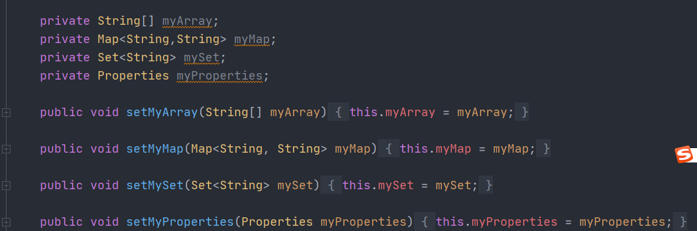

# Spring框架学习

## Spring的核心思想-IOC和AOP

- **IOC**
- **AOP**

### IOC的基本介绍

#### 什么是IOC?

IOC = Inversion of Control(控制反转),IOC只是一种技术思想

在java中使用IOC开发,无需自己new对象,使用IOC容器帮助我们实例化对象并管理它,我们需要使用哪个对象就从IOC容器中获取,对象的生命周期都由IOC容器进行管理

**为什么称为控制反转?**

- **控制**:指的是对象创建(实例化,管理)的权利

- **反转**:控制权交由外部管理

#### IOC解决了什么问题?

解决了对象之间耦合的问题


#### IOC与DI的区别?

IOC与DI描述的是一件事件,**IOC是目的,DI是手段**,DI就是依赖注入,也是Spring中实现IOC最常用的方式,站在容器的角度上看,DI将对象所需要依赖的对象都从容器中主动注入,达到IOC的目的

### AOP的基本介绍

#### 什么是AOP?

AOP = Aspect Oriented Programming 面向切面编程

在多个流程中出现了相同子流程的代码,我们称之为横切逻辑代码,例如在获取方法调用的时间消耗,如果手工在每个方法上面增加,导致编码重复并且不易修改,与业务逻辑代码混杂在一起,不方便管理

AOP提出来切面的概念,将横切逻辑代码与业务代码抽离出来,单独管理,达到非侵入式的效果

#### AOP解决了什么问题?

在不改变原有业务逻辑代码的同时,增强横切逻辑代码,从根本上解耦合,避免了横切代码重复的问题

#### 为什么叫面向切面编程?

**切:**指的是横切的逻辑代码,在不修改原有业务逻辑代码的同时,只操作横切逻辑代码,面向横切逻辑编程

**面**:横切逻辑代码往往影响多个方法,每一个方法都像一个点,多个点构成一个面,称为切面

## 为什么要使用IOC和AOP？

### 常规版本代码,不使用IOC和AOP

一个简单的service层调用DAO层示例代码

**pojo类:**

```java
public class Account {

    private String cardNo;
    private String name;
    private int money;
}
```

**DAO类:**

```java
public interface AccountDao {
    Account queryAccountByCardNo(String cardNo) throws Exception;
    int updateAccountByCardNo(Account account) throws Exception;
}
public class JdbcAccountDaoImpl implements AccountDao {
    @Override
    public Account queryAccountByCardNo(String cardNo) throws Exception {
        //从连接池获取连接
         Connection con = DruidUtils.getInstance().getConnection();
        String sql = "select * from account where cardNo = ?";
        PreparedStatement preparedStatement = con.prepareStatement(sql);
        preparedStatement.setString(1,cardNo);
        ResultSet resultSet = preparedStatement.executeQuery();

        Account account = new Account();
        while(resultSet.next()) {
            account.setCardNo(resultSet.getString("cardNo"));
            account.setName(resultSet.getString("name"));
            account.setMoney(resultSet.getInt("money"));
        }
        resultSet.close();
        preparedStatement.close();
        con.close();
        return account;
    }

    @Override
    public int updateAccountByCardNo(Account account) throws Exception {

        // 从连接池获取连接
        // 改造为：从当前线程当中获取绑定的connection连接
        Connection con = DruidUtils.getInstance().getConnection();
        String sql = "update account set money=? where cardNo=?";
        PreparedStatement preparedStatement = con.prepareStatement(sql);
        preparedStatement.setInt(1,account.getMoney());
        preparedStatement.setString(2,account.getCardNo());
        int i = preparedStatement.executeUpdate();

        preparedStatement.close();
        con.close();
        return i;
    }
}
```

**service类**:

```java
public interface TransferService {
    void transfer(String fromCardNo,String toCardNo,int money) throws Exception;
}

public class TransferServiceImpl implements TransferService {

    private AccountDao accountDao = new JdbcAccountDaoImpl();
    
    @Override
    public void transfer(String fromCardNo, String toCardNo, int money) throws Exception {
            Account from = accountDao.queryAccountByCardNo(fromCardNo);
            Account to = accountDao.queryAccountByCardNo(toCardNo);
            from.setMoney(from.getMoney()-money);
            to.setMoney(to.getMoney()+money);
            accountDao.updateAccountByCardNo(to);
            accountDao.updateAccountByCardNo(from);
    }
}

```

**Utils类**：

```java
public class DruidUtils {

    private DruidUtils(){
    }

    private static DruidDataSource druidDataSource = new DruidDataSource();


    static {
        druidDataSource.setDriverClassName("com.mysql.jdbc.Driver");
        druidDataSource.setUrl("jdbc:mysql://localhost:3306/bank");
        druidDataSource.setUsername("root");
        druidDataSource.setPassword("mysql");

    }

    public static DruidDataSource getInstance() {
        return druidDataSource;
    }

}
```

**初始数据:**


**测试类**:

```java
public class Test {
    public static void main(String[] args) throws Exception {
        TransferService transferService = new TransferServiceImpl();
        transferService.transfer("111111","222222",100);
    }  
}
```

**执行一次结果为**:


### 常规代码问题分析

- TransferService与AccountDao 两个接口都是用new 出来的对象,如果新增了新的接口实现类,需要切换实现类的时候,要修改相关的代码,耦合性太严重

- `JdbcAccountDaoImpl#updateAccountByCardNo`两个方法之间没有用同一个事务进行控制,如果出现异常会导致数据异常 

#### 问题解决方案

1. 使用配置文件将对应接口的实现类注册在XML配置文件中,并使用反射进行初始化实例类,可以使用简单工厂模式获取对应实例
2. 同一个线程中,使用同一个Connection进行请求数据库,并增加事务控制

### 修正后代码实现

#### 解析配置文件并使用工厂模式获取对应类实例

**新增配置文件**:

```xml
<?xml version="1.0" encoding="utf-8" ?>
<beans>
    <bean id = "accountDao" class ="com.zhengyao.dao.impl.JdbcAccountDaoImpl"/>
    <bean id = "transferService" class ="com.zhengyao.service.impl.TransferServiceImpl">
        <property id = "AccountDao" ref = "accountDao"/>
    </bean>
</beans>
```

**新建BeansFactory**

```java
public class BeansFactory {

    private static Map<String, Object> classMap = new HashMap<>();

    static {
        InputStream resourceAsStream = BeansFactory.class.getClassLoader().getResourceAsStream("config.xml");
        SAXReader saxReader = new SAXReader();
        try {
            //使用dom4j解析XML配置文件
            Document read = saxReader.read(resourceAsStream);
            Element rootElement = read.getRootElement();
            List<Element> list = rootElement.selectNodes("//bean");
            //先将所有的bean 给解析完成
            for (Element element : list) {
                String id = element.attributeValue("id");
                String className = element.attributeValue("class");
                Class<?> clazz = Class.forName(className);
                Object obj = clazz.newInstance();
                classMap.put(id,obj);
            }
            //解析所有的property,这里只配置了ref类型
            List<Element> propertyList = rootElement.selectNodes("//property");
            for (Element element : propertyList) {
                Element parent = element.getParent();
                String parentId = parent.attributeValue("id");
                String elementId = element.attributeValue("id");
                String ref = element.attributeValue("ref");
                Object object = classMap.get(parentId);
                Object refObj = classMap.get(ref);
                Method[] declaredMethods = object.getClass().getDeclaredMethods();
                for (Method declaredMethod : declaredMethods) {
                    //使用set 方法注入
                    if (declaredMethod.getName().equals("set" + elementId)) {
                        declaredMethod.invoke(object,refObj);
                        break;
                    }
                }
                classMap.put(parentId, object);
            }

        } catch (Exception e) {
            e.printStackTrace();
        }
    }
    
    public static Object getClass(String id){
        return classMap.get(id);
    }
}
```

**原有代码中使用set方法注入**:

```java
public class TransferServiceImpl implements TransferService {

    private AccountDao accountDao;
    //使用set方法注入
    public void setAccountDao(AccountDao accountDao) {
        this.accountDao = accountDao;
    }

    @Override
    public void transfer(String fromCardNo, String toCardNo, int money) throws Exception {
    //省略相同代码
    }
```

**测试类:**

```java
public class Test2 {
    
    public static void main(String[] args) throws Exception {
        TransferService transferService = (TransferService) BeansFactory.getClass("transferService");
        transferService.transfer("111111","222222",100);
    }
}
```

#### 扩展点-新增同一线程内事务控制

提示：使用动态代理新增事务控制代码

## Spring中IOC应用

Spring配置的三种方式


### 纯xml模式

- xml ⽂件头

  ```xml
  <?xml version="1.0" encoding="UTF-8"?>
  <beans xmlns="http://www.springframework.org/schema/beans"
  xmlns:xsi="http://www.w3.org/2001/XMLSchema-instance"
  xsi:schemaLocation="http://www.springframework.org/schema/beans
  https://www.springframework.org/schema/beans/spring-beans.xsd">
  ```

- 实例化Bean的三种方式

  - 方式⼀：使用⽆参构造函数
    在默认情况下，它会通过反射调用⽆参构造函数来创建对象。如果类中没有⽆参构造函数，将创建
    失败。

    ```xml
    <!--方式一：使用无参构造器（推荐）-->
        <bean id="connectionUtils" class="com.zhengyao.edu.utils.ConnectionUtils"></bean>
    ```

  - 方式二：使用静态方法创建

    在实际开发中，我们使用的对象有些时候并不是直接通过构造函数就可以创建出来的，它可能在创
    建的过程 中会做很多额外的操作。此时会提供⼀个创建对象的方法，恰好这个方法是static修饰的
    方法，即是此种情 况。

    ```xml
    <!--方式二：静态方法-->
       <bean id="connectionUtils" class="CreateBeanFactory" factory-method="getInstanceStatic"/>
    ```

  - 方式三：使用实例化方法创建

    此种方式和上⾯静态方法创建其实类似，区别是用于获取对象的方法不再是static修饰的了，⽽是
    类中的⼀ 个普通方法。此种方式⽐静态方法创建的使用⼏率要⾼⼀些。
    在早期开发的项⽬中，⼯⼚类中的方法有可能是静态的，也有可能是⾮静态方法，当是⾮静态方法
    时，即可 采用下⾯的配置方式：

    ```xml
    <bean id="createBeanFactory" class="CreateBeanFactory"></bean>
        <bean id="connectionUtils" factory-bean="createBeanFactory" factory-method="getInstance"/>
    ```


#### Bean的作用范围及生命周期

**bean的作用范围**

在spring框架管理Bean对象的创建时，Bean对象默认都是单例的，但是它⽀持配置的方式改
变作用范围。作用范围官方提供的说明如下图：


在上图中提供的这些选项中，我们实际开发中用到最多的作用范围就是singleton（单例模式）和
prototype（原型模式，也叫多例模式）

```xml
<bean id="accountDao" class="com.zhengyao.edu.dao.impl.JdbcAccountDaoImpl" scope="singleton"></bean>
```

单例模式：singleton

- 对象出⽣：当创建容器时，对象就被创建了。
- 对象活着：只要容器在，对象⼀直活着。
- 对象死亡：当销毁容器时，对象就被销毁了。
- ⼀句话总结：单例模式的bean对象⽣命周期与容器相同。

多例模式：prototype

- 对象出⽣：当使用对象时，创建新的对象实例。
- 对象活着：只要对象在使用中，就⼀直活着。
- 对象死亡：当对象⻓时间不用时，被java的垃圾回收器回收了。
- ⼀句话总结：多例模式的bean对象，spring框架只负责创建，不负责销毁。

#### Bean的标签属性

在基于xml的IoC配置中，bean标签是最基础的标签。它表示了IoC容器中的⼀个对象。换句话
说，如果⼀个对象想让spring管理，在XML的配置中都需要使用此标签配置，Bean标签的属性如
下：

- id属性： 用于给bean提供⼀个唯⼀标识。在⼀个标签内部，标识必须唯⼀。
- class属性：用于指定创建Bean对象的全限定类名。
- name属性：用于给bean提供⼀个或多个名称。多个名称用空格分隔。
- factory-bean属性：用于指定创建当前bean对象的⼯⼚bean的唯⼀标识。当指定了此属性之后，
  class属性失效。
- factory-method属性：用于指定创建当前bean对象的⼯⼚方法，如配合factory-bean属性使用，
  则class属性失效。如配合class属性使用，则方法必须是static的。
- scope属性：用于指定bean对象的作用范围。通常情况下就是singleton。当要用到多例模式时，
  可以配置为prototype。
- init-method属性：用于指定bean对象的初始化方法，此方法会在bean对象装配后调用。必须是
  ⼀个⽆参方法。
- destory-method属性：用于指定bean对象的销毁方法，此方法会在bean对象销毁前执⾏。它只
  能为scope是singleton时起作用。

#### DI 依赖注入的xml配置

依赖注入分类

按照注入的方式分类

- 构造函数注入：顾名思义，就是利用带参构造函数实现对类成员的数据赋值。
- set方法注入：它是通过类成员的set方法实现数据的注入。（使用最多的）

按照注入的数据类型分类

- 基本类型和String
  - 注入的数据类型是基本类型或者是字符串类型的数据。

- 其他Bean类型
  - 注入的数据类型是对象类型，称为其他Bean的原因是，这个对象是要求出现在IoC容器
    中的。那么针对当前Bean来说，就是其他Bean了。

复杂类型（集合类型）

- 注入的数据类型是Aarry，List，Set，Map，Properties中的⼀种类型。
  - 依赖注入的配置实现之构造函数注入 顾名思义，就是利用构造函数实现对类成员的赋值。它
    的使用要求是，类中提供的构造函数参数个数必须和配置的参数个数⼀致，且数据类型匹
    配。同时需要注意的是，当没有⽆参构造时，则必须提供构造函数参数的注入，否则Spring
    框架会报错。

在使⽤构造函数注⼊时，涉及的标签是 constructor-arg ，该标签有如下属性：

- name：⽤于给构造函数中指定名称的参数赋值。
- index：⽤于给构造函数中指定索引位置的参数赋值。
- value：⽤于指定基本类型或者String类型的数据。
- ref：⽤于指定其他Bean类型的数据。写的是其他bean的唯⼀标识。


依赖注⼊的配置实现之set⽅法注⼊
顾名思义，就是利⽤字段的set⽅法实现赋值的注⼊⽅式。此种⽅式在实际开发中是使⽤最多的注
⼊⽅式。

在使⽤set⽅法注⼊时，需要使⽤ property 标签，该标签属性如下：

- name：指定注⼊时调⽤的set⽅法名称。（注：不包含set这三个字⺟,druid连接池指定属性名称）

- value：指定注⼊的数据。它⽀持基本类型和String类型。

- ref：指定注⼊的数据。它⽀持其他bean类型。写的是其他bean的唯⼀标识。

- 复杂数据类型注⼊ ⾸先，解释⼀下复杂类型数据，它指的是集合类型数据。集合分为两类，⼀类
  是List结构（数组结构），⼀类是Map接⼝（键值对） 。

  ```xml
  <property name="myArray">
              <array>
                  <value>array1</value>
                  <value>array2</value>
                  <value>array3</value>
              </array>
          </property>
  
          <property name="myMap">
              <map>
                  <entry key="key1" value="value1"/>
                  <entry key="key2" value="value2"/>
              </map>
          </property>
  
          <property name="mySet">
              <set>
                  <value>set1</value>
                  <value>set2</value>
              </set>
          </property>
  
          <property name="myProperties">
              <props>
                  <prop key="prop1">value1</prop>
                  <prop key="prop2">value2</prop>
              </props>
          </property>
  ```

  

## Spring中AOP的使用

AOP本质：在不改变原有业务逻辑的情况下增强横切逻辑，横切逻辑代码往往是权限校验代码、⽇志代
码、事务控制代码、性能监控代码。

### AOP 相关术语


上图描述的就是未采⽤AOP思想设计的程序，当我们红⾊框中圈定的⽅法时，会带来⼤量的重复劳动。
程序中充斥着⼤量的重复代码，使我们程序的独⽴性很差。⽽下图中是采⽤了AOP思想设计的程序，它
把红框部分的代码抽取出来的同时，运⽤动态代理技术，在运⾏期对需要使⽤的业务逻辑⽅法进⾏增
强


### AOP 术语

| 名词              | 解释                                                         |
| ----------------- | ------------------------------------------------------------ |
| Joinpoint(连接点) | 它指的是那些可以⽤于把增强代码加⼊到业务主线中的点，那么由上图中我们可以看出，这些点指的就是⽅法。在⽅法执⾏的前后通过动态代理技术加⼊增强的代码。在Spring框架AOP思想的技术实现中，也只⽀持⽅法类型的连接点。 |
| Pointcut(切⼊点)  | 它指的是那些已经把增强代码加⼊到业务主线进来之后的连接点。由上图中，我们看出表现层 transfer ⽅法就只是连接点，因为判断访问权限的功能并没有对其增强。 |
| Advice(通知/增强) | 它指的是切⾯类中⽤于提供增强功能的⽅法。并且不同的⽅法增强的时机是不⼀样的。⽐如，开启事务肯定要在业务⽅法执⾏之前执⾏；提交事务要在业务⽅法正常执⾏之后执⾏，⽽回滚事务要在业务⽅法执⾏产⽣异常之后执⾏等等。那么这些就是通知的类型。其分类有：前置通知 后置通知 异常通知 最终通知 环绕通知。 |
| Target(⽬标对象)  | 它指的是代理的⽬标对象。即被代理对象。                       |
| Proxy(代理)       | 它指的是⼀个类被AOP织⼊增强后，产⽣的代理类。即代理对象。    |
| Weaving(织⼊)     | 它指的是把增强应⽤到⽬标对象来创建新的代理对象的过程。spring采⽤动态代理织⼊，⽽AspectJ采⽤编译期织⼊和类装载期织⼊。 |
| Aspect(切⾯)      | 它指定是增强的代码所关注的⽅⾯，把这些相关的增强代码定义到⼀个类中，这个类就是切⾯类。例如，事务切⾯，它⾥⾯定义的⽅法就是和事务相关的，像开启事务，提交事务，回滚事务等等，不会定义其他与事务⽆关的⽅法。我们前⾯的案例中 TrasnactionManager 就是⼀个切⾯。 |

连接点：⽅法开始时、结束时、正常运⾏完毕时、⽅法异常时等这些特殊的时机点，我们称之为连接点，项⽬中每个⽅法都有连接点，连接点是⼀种候选点

切⼊点：指定AOP思想想要影响的具体⽅法是哪些，描述感兴趣的⽅法

Advice增强：
第⼀个层次：指的是横切逻辑
第⼆个层次：⽅位点（在某⼀些连接点上加⼊横切逻辑，那么这些连接点就叫做⽅位点，描述的是具体
的特殊时机）

Aspect切⾯：切⾯概念是对上述概念的⼀个综合
Aspect切⾯= 切⼊点+增强
= 切⼊点（锁定⽅法） + ⽅位点（锁定⽅法中的特殊时机）+ 横切逻辑

众多的概念，⽬的就是为了锁定要在哪个地⽅插⼊什么横切逻辑代码

### Spring中AOP的代理选择

Spring 实现AOP思想使⽤的是动态代理技术默认情况下，Spring会根据被代理对象是否实现接⼝来选择使⽤JDK还是CGLIB。当被代理对象没有实现任何接⼝时，Spring会选择CGLIB。当被代理对象实现了接⼝，Spring会选择JDK官⽅的代理技术，不过我们可以通过配置的⽅式，让Spring强制使⽤CGLIB。

### Spring中AOP的配置⽅式

在Spring的AOP配置中，也和IoC配置⼀样，⽀持3类配置⽅式。

第⼀类：使⽤XML配置

第⼆类：使⽤XML+注解组合配置

第三类：使⽤纯注解配置

#### XML 模式

```xml
<dependency>
<groupId>org.springframework</groupId>
<artifactId>spring-aop</artifactId>
<version>5.1.12.RELEASE</version>
</dependency>
<dependency>
<groupId>org.aspectj</groupId>
<artifactId>aspectjweaver</artifactId>
<version>1.9.4</version>
</dependency>
```

**AOP核心配置**

```xml
<!--
Spring基于XML的AOP配置前期准备：
在spring的配置⽂件中加⼊aop的约束
xmlns:aop="http://www.springframework.org/schema/aop"
http://www.springframework.org/schema/aop
https://www.springframework.org/schema/aop/spring-aop.xsd
Spring基于XML的AOP配置步骤：
第⼀步：把通知Bean交给Spring管理
第⼆步：使⽤aop:config开始aop的配置
第三步：使⽤aop:aspect配置切⾯
第四步：使⽤对应的标签配置通知的类型
⼊⻔案例采⽤前置通知，标签为aop:before
-->
<!--把通知bean交给spring来管理-->
<bean id="logUtil" class="com.zhengyao.utils.LogUtil"></bean>
<!--开始aop的配置-->
<aop:config>
<!--配置切⾯-->
<aop:aspect id="logAdvice" ref="logUtil">
<!--配置前置通知-->
<aop:before method="printLog" pointcut="execution(public *
com.zhengyao.service.impl.TransferServiceImpl.updateAccountByCardNo(com.zhengyao
.pojo.Account))"></aop:before>
</aop:aspect>
</aop:config>
```

**切入点表达式**

关于切⼊点表达式上述配置实现了对 TransferServiceImpl 的 updateAccountByCardNo ⽅法进⾏增强，在其
执⾏之前，输出了记录⽇志的语句。这⾥⾯，我们接触了⼀个⽐较陌⽣的名称：切⼊点表达式，它是做什么的呢？我们往下看。

概念及作⽤
切⼊点表达式，也称之为AspectJ切⼊点表达式，指的是遵循特定语法结构的字符串，其
作⽤是⽤于对符合语法格式的连接点进⾏增强。它是AspectJ表达式的⼀部分。

关于AspectJ

AspectJ是⼀个基于Java语⾔的AOP框架，Spring框架从2.0版本之后集成了AspectJ框架
中切⼊点表达式的部分，开始⽀持AspectJ切⼊点表达式。

切⼊点表达式使⽤示例

```java
全限定⽅法名 访问修饰符 返回值 包名.包名.包名.类名.⽅法名(参数列表)
全匹配⽅式：
public void com.zhengyao.service.impl.TransferServiceImpl.updateAccountByCardNo(c
om.zhengyao.pojo.Account)
访问修饰符可以省略
void com.zhengyao.service.impl.TransferServiceImpl.updateAccountByCardNo(c
om.zhengyao.pojo.Account)
返回值可以使⽤*，表示任意返回值
* com.zhengyao.service.impl.TransferServiceImpl.updateAccountByCardNo(c
om.zhengyao.pojo.Account)
    包名可以使⽤.表示任意包，但是有⼏级包，必须写⼏个
* ....TransferServiceImpl.updateAccountByCardNo(com.zhengyao.pojo.Accou
nt)
包名可以使⽤..表示当前包及其⼦包
* ..TransferServiceImpl.updateAccountByCardNo(com.zhengyao.pojo.Account
)
类名和⽅法名，都可以使⽤.表示任意类，任意⽅法
* ...(com.zhengyao.pojo.Account)
参数列表，可以使⽤具体类型
基本类型直接写类型名称 ： int
引⽤类型必须写全限定类名：java.lang.String
参数列表可以使⽤*，表示任意参数类型，但是必须有参数
* *..*.*(*)
参数列表可以使⽤..，表示有⽆参数均可。有参数可以是任意类型
* *..*.*(..)
全通配⽅式：
* *..*.*(..)
```

**改变代理⽅式的配置**

在前⾯我们已经说了，Spring在选择创建代理对象时，会根据被代理对象的实际情况来选择
的。被代理对象实现了接⼝，则采⽤基于接⼝的动态代理。当被代理对象没有实现任何接⼝
的时候，Spring会⾃动切换到基于⼦类的动态代理⽅式。
但是我们都知道，⽆论被代理对象是否实现接⼝，只要不是final修饰的类都可以采⽤cglib提
供的⽅式创建代理对象。所以Spring也考虑到了这个情况，提供了配置的⽅式实现强制使⽤
基于⼦类的动态代理（即cglib的⽅式），配置的⽅式有两种

- 使⽤aop:config标签配置

  ```xml
  <aop:config proxy-target-class="true">
  ```

  

- 使⽤aop:aspectj-autoproxy标签配置

  ```xml
  <!--此标签是基于XML和注解组合配置AOP时的必备标签，表示Spring开启注解配置AOP
  的⽀持-->
  <aop:aspectj-autoproxy proxy-target-class="true"></aop:aspectj-autoproxy>
  ```

  

**五种通知类型**

- 前置通知

  ```xml
  <!--
  作⽤：
  ⽤于配置前置通知。
  出现位置：
  它只能出现在aop:aspect标签内部
  属性：
  method：⽤于指定前置通知的⽅法名称
  pointcut：⽤于指定切⼊点表达式
  pointcut-ref：⽤于指定切⼊点表达式的引⽤
  -->
  <aop:before method="printLog" pointcut-ref="pointcut1">
  </aop:before>
  ```

  执⾏时机
  前置通知永远都会在切⼊点⽅法（业务核⼼⽅法）执⾏之前执⾏。

  细节
  前置通知可以获取切⼊点⽅法的参数，并对其进⾏增强。

- 正常执⾏时通知

  ```xml
  <!--
  作⽤：
  ⽤于配置正常执⾏时通知
  出现位置：
  它只能出现在aop:aspect标签内部
  属性：
  method:⽤于指定后置通知的⽅法名称
  pointcut:⽤于指定切⼊点表达式
  pointcut-ref:⽤于指定切⼊点表达式的引⽤
  -->
  <aop:after-returning method="afterReturningPrintLog" pointcut-ref="pt1"></aop:after-returning>
  ```

- 异常通知

  ```xml
  <!--
  作⽤：
  ⽤于配置异常通知。
  出现位置：
  它只能出现在aop:aspect标签内部
  属性：
  method:⽤于指定异常通知的⽅法名称
  pointcut:⽤于指定切⼊点表达式
  pointcut-ref:⽤于指定切⼊点表达式的引⽤
  -->
  <aop:after-throwing method="afterThrowingPrintLog" pointcut-ref="pt1"></aop:after-throwing>
  ```

  异常通知的执⾏时机是在切⼊点⽅法（业务核⼼⽅法）执⾏产⽣异常之后，异常通知执⾏。如果切
  ⼊点⽅法执⾏没有产⽣异常，则异常通知不会执⾏。

  **细节**

  异常通知不仅可以获取切⼊点⽅法执⾏的参数，也可以获取切⼊点⽅法执⾏产⽣的异常信息。

- 最终通知

  ```xml
  <!--
  作⽤：
  ⽤于指定最终通知。
  出现位置：
  它只能出现在aop:aspect标签内部
  属性：
  method:⽤于指定最终通知的⽅法名称
  pointcut:⽤于指定切⼊点表达式
  pointcut-ref:⽤于指定切⼊点表达式的引⽤
  -->
  <aop:after method="afterPrintLog" pointcut-ref="pt1"></aop:after>
  ```

  **执⾏时机**
  最终通知的执⾏时机是在切⼊点⽅法（业务核⼼⽅法）执⾏完成之后，切⼊点⽅法返回之前执⾏。
  换句话说，⽆论切⼊点⽅法执⾏是否产⽣异常，它都会在返回之前执⾏。

  **细节**
  最终通知执⾏时，可以获取到通知⽅法的参数。同时它可以做⼀些清理操作。

- 环绕通知

  ```xml
  <!--
  作⽤：
  ⽤于配置环绕通知。
  出现位置：
  它只能出现在aop:aspect标签的内部
  属性：
  method:⽤于指定环绕通知的⽅法名称
  pointcut:⽤于指定切⼊点表达式
  pointcut-ref:⽤于指定切⼊点表达式的引⽤
  -->
  <aop:around method="aroundPrintLog" pointcut-ref="pt1"></aop:around>
  ```

  **特别说明**
  环绕通知，它是有别于前⾯四种通知类型外的特殊通知。前⾯四种通知（前置，后置，异常和最终）
  它们都是指定何时增强的通知类型。⽽环绕通知，它是Spring框架为我们提供的⼀种可以通过编码的
  ⽅式，控制增强代码何时执⾏的通知类型。它⾥⾯借助的ProceedingJoinPoint接⼝及其实现类，
  实现⼿动触发切⼊点⽅法的调⽤。


#### XML+注解模式

XML 中开启 Spring 对注解 AOP 的⽀持

```xml
<!--开启spring对注解aop的⽀持-->
<aop:aspectj-autoproxy/>
```

```java
@Component
@Aspect
public class LogUtils {


    @Pointcut("execution(* com.zhengyao.edu.service.impl.TransferServiceImpl.*(..))")
    public void pt1(){

    }


    /**
     * 业务逻辑开始之前执行
     */
    @Before("pt1()")
    public void beforeMethod(JoinPoint joinPoint) {
        Object[] args = joinPoint.getArgs();
        for (int i = 0; i < args.length; i++) {
            Object arg = args[i];
            System.out.println(arg);
        }
        System.out.println("业务逻辑开始执行之前执行.......");
    }


    /**
     * 业务逻辑结束时执行（无论异常与否）
     */
    @After(value = "pt1()")
    public void afterMethod() {
        System.out.println("业务逻辑结束时执行，无论异常与否都执行.......");
    }


    /**
     * 异常时时执行
     */
    @AfterThrowing("pt1()")
    public void exceptionMethod() {
        System.out.println("异常时执行.......");
    }


    /**
     * 业务逻辑正常时执行
     */
    @AfterReturning(value = "pt1()",returning = "retVal")
    public void successMethod(Object retVal) {
        System.out.println("业务逻辑正常时执行.......");
    }


    /**
     * 环绕通知
     *
     */
    @Around("pt1()")
    public Object arroundMethod(ProceedingJoinPoint proceedingJoinPoint) throws Throwable {
        System.out.println("环绕通知中的beforemethod....");

        Object result = null;
        try{
            // 控制原有业务逻辑是否执行
            // result = proceedingJoinPoint.proceed(proceedingJoinPoint.getArgs());
        }catch(Exception e) {
            System.out.println("环绕通知中的exceptionmethod....");
        }finally {
            System.out.println("环绕通知中的after method....");
        }

        return result;
    }

}
```

#### 注解模式

在使⽤注解驱动开发aop时，我们要明确的就是，是注解替换掉配置⽂件中的下⾯这⾏配置：

```xml
<!--开启spring对注解aop的⽀持-->
<aop:aspectj-autoproxy/>
```

在配置类中使⽤如下注解进⾏替换上述配置

```java
@Configuration
@ComponentScan("com.zhengyao")
@EnableAspectJAutoProxy //开启spring对注解AOP的⽀持
public class SpringConfiguration {
}
```

